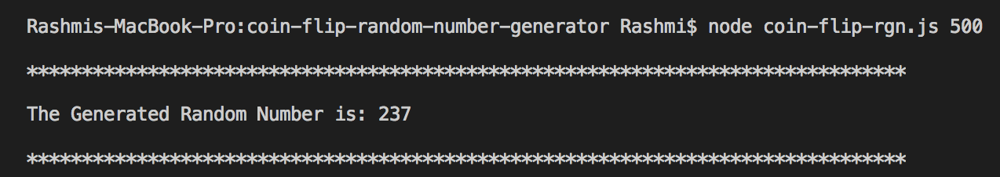
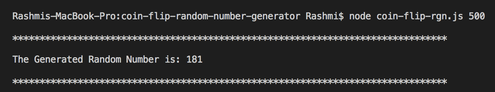

# Coin Flip Random Number Generator

This is a node.js implementation of a Random Number Generator. The Random numbers are generated based on coin flips. There is a function called flip()that return True or False with a 50% probability. I have to use this function as my only sourse of randomness to generate a number in the range [0,n). where n is greater than 0 and less than 1,000,000

## Approach

1) Convert the number __"n"__ into its binary representation
2) Find the number of bits required to represnet the above number
3) Generate a binary number by flipping the coin for every bit found in the step 2
4) Convert the binary representation to decimal
5) Check if the decimal number in step 4 is in the range [0,n)
    * Return the number if its in range
    * Other wise repeat the step 3  


## How to execute the script?
You would need node inorder to execute the code. Refer [here](https://nodejs.org/en/download/package-manager/) to install node.js

Once node is installed, run the script using the following command:

```
node coin-flip-rgn.js 500
```




*Note:* The script expects a numeric input

